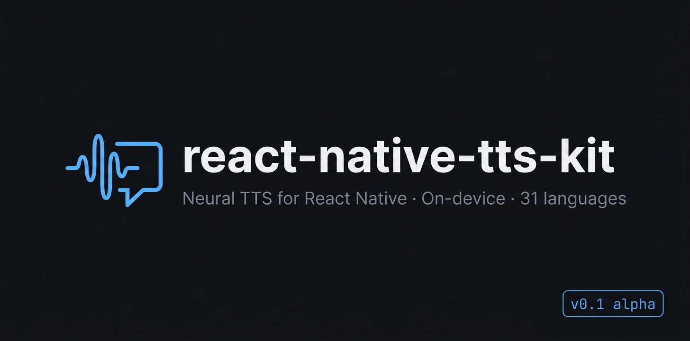

# react-native-tts-kit

<p align="center">
  
</p>

**Neural text-to-speech for React Native and Expo. On-device. Sub-100ms. 31 languages.**

```ts
import TTSKit from 'react-native-tts-kit';

await TTSKit.speak('Hello, world.');
```

No API keys. No network. No robotic system voice.

> **Status:** v0.1 alpha. iOS verified on iPhone (iOS 26+). Android scaffolded but not yet validated on a real device. Feedback via [GitHub issues](https://github.com/ahk-d/react-native-tts-kit/issues).

---

## Why

| | Quality | Offline | Cost | Languages |
|---|---|---|---|---|
| `expo-speech` (system) | robotic | ✅ | free | OS-bound |
| ElevenLabs / OpenAI TTS | excellent | ❌ | per-request | 30+ |
| **`react-native-tts-kit`** | **neural** | **✅** | **free** | **31** |

There was no good answer for on-device neural TTS in React Native. We needed it for [Flowent](https://getflowent.com), so we built it and open-sourced it.

---

## Install

```bash
npx expo install react-native-tts-kit
npx expo prebuild --platform ios
cd ios && pod install && cd ..
npx expo run:ios --device
```

Bare RN: same flow, just install `expo-modules-core` as a peer dep.

> Custom native code can't run inside Expo Go — use a dev build. Standard Expo workflow in 2026.

---

## Use

```ts
import TTSKit from 'react-native-tts-kit';

// Default: F1 voice, English
await TTSKit.speak('Hello, world.');

// Pair any voice with any of 31 languages
await TTSKit.speak('Bonjour le monde',  { voice: 'F1', language: 'fr' });
await TTSKit.speak('こんにちは',          { voice: 'M2', language: 'ja' });
await TTSKit.speak('안녕하세요',          { voice: 'F3', language: 'ko' });

// Stream long text — first audio arrives before synthesis finishes
const stream = TTSKit.stream(longArticle, { language: 'en' });
stream.on('chunk', (pcm) => { /* PCM16LE @ 44.1 kHz */ });
stream.on('end',   () => {});

// Stop in-flight synthesis
await TTSKit.stop();
```

### First-launch UX

The model is ~210 MB (multilingual split — 31 languages, fp16 weights) and downloads on first use. Call `prefetchModel()` from a settings screen so users aren't surprised mid-conversation:

```ts
await TTSKit.prefetchModel((p) => {
  setProgress(p.percent); // 0–100
});
```

Once downloaded, all calls are instant and offline forever.

### Voices

10 voices, all language-agnostic. Pair any voice with any language.

| Male  | M1, M2, M3, M4, M5 |
|-------|---------------------|
| Female | F1, F2, F3, F4, F5 |

```ts
const voices = await TTSKit.getVoices();
// [{ id: 'F1', name: 'F1', gender: 'female', engine: 'supertonic' }, ...]
```

### Languages (31, verified on-device)

All 31 languages produce intelligible neural-quality audio on iPhone.
The example app ([`example/App.tsx`](example/App.tsx)) ships a tappable
sample sentence for every one.

| | | | | |
|---|---|---|---|---|
| Arabic (`ar`) | Bulgarian (`bg`) | Czech (`cs`) | Danish (`da`) | German (`de`) |
| Greek (`el`) | English (`en`) | Spanish (`es`) | Estonian (`et`) | Finnish (`fi`) |
| French (`fr`) | Hindi (`hi`) | Croatian (`hr`) | Hungarian (`hu`) | Indonesian (`id`) |
| Italian (`it`) | Japanese (`ja`) | Korean (`ko`) | Lithuanian (`lt`) | Latvian (`lv`) |
| Dutch (`nl`) | Polish (`pl`) | Portuguese (`pt`) | Romanian (`ro`) | Russian (`ru`) |
| Slovak (`sk`) | Slovenian (`sl`) | Swedish (`sv`) | Turkish (`tr`) | Ukrainian (`uk`) |
| Vietnamese (`vi`) | | | | |

```ts
import { SUPERTONIC_LANGUAGES } from 'react-native-tts-kit';

await TTSKit.speak('こんにちは', { voice: 'F1', language: 'ja' });
await TTSKit.speak('Привет',     { voice: 'M2', language: 'ru' });
await TTSKit.speak('नमस्ते',      { voice: 'F3', language: 'hi' });
```

Voices are language-agnostic — any voice can speak any language.

### Engines

```ts
TTSKit.setEngine('supertonic'); // default — neural, on-device
TTSKit.setEngine('system');     // expo-speech fallback (robotic but free)
```

| Engine | Status | Use when |
|---|---|---|
| `supertonic` | ✅ shipping | Production neural TTS |
| `system` | ✅ shipping | Fallback, no model download |
| `neutts` (voice cloning) | ⏳ v1.1 | 3-second voice clone |
| `cloud:eleven` / `cloud:openai` | ⏳ v1.2 | When you want premium quality |

---

## Performance

Measured on iPhone (iOS 26.4, Debug build):

| Metric | Value |
|---|---|
| Time to first audio (1 sentence) | ~70 ms |
| Real-time factor | < 0.5× |
| Cold start (first speak after launch) | ~1–2 s |
| Memory (peak during synthesis) | ~250 MB |

Reproducible benchmark harness in [`benchmarks/`](benchmarks/). Numbers across more devices (iPhone 14, Pixel 8, mid-tier Android) coming with v1.0.

---

## Privacy

Text passed to `speak()` and `stream()` is processed entirely on-device. Once the model is downloaded (one-time, on first `prefetchModel()` call), **no text or audio crosses the network at runtime** — synthesis runs in the local ONNX session and audio plays through the platform audio engine.

The only network activity this package performs is the initial model download from HuggingFace (see [`ATTRIBUTIONS.md`](ATTRIBUTIONS.md) for endpoints). Downloads are SHA-256-verified against fingerprints baked into the package when present. If you ship your app in a privacy-sensitive context, an offline mode (e.g. bundling the model file with your app's assets) is also supported — see [CONTRIBUTING.md](CONTRIBUTING.md).

---

## Architecture

```
your app
   ↓
TTSKit                        — public API ([src/index.ts](src/index.ts))
   ↓
SupertonicEngine                 — JS wrapper, listens for native events
   ↓
RNTTSKitModule                — Expo Module bridge ([ios/](ios/), [android/](android/))
   ↓
4 ONNX sessions                  — duration_predictor → text_encoder
                                   → vector_estimator (×8 denoising)
                                   → vocoder
   ↓
Float32 PCM @ 44.1 kHz           — AVAudioEngine / AudioTrack playback
```

Model weights: [Supertonic-3](https://huggingface.co/Supertone/supertonic-3) (99M params, OpenRAIL-M). We host a [pinned mirror](https://huggingface.co/ahk-d/supertonic-3) for resilience.

---

## License

| Component | License |
|---|---|
| This package | MIT |
| Supertonic-3 model weights | [BigScience OpenRAIL-M](licenses/OpenRAIL-M.txt) |
| ONNX Runtime, Expo Modules | MIT |

**If you ship this in your app**, OpenRAIL-M requires you to:

1. Bind your end users to the [Use Restrictions](ATTRIBUTIONS.md#what-you-cannot-do-attachment-a--use-restrictions) — most importantly **no impersonation/deepfakes without consent** and **AI-generated audio must be disclosed**.
2. Ship a copy of [`licenses/OpenRAIL-M.txt`](licenses/OpenRAIL-M.txt) with your app.
3. Preserve the Supertone copyright notice.

A 2-line ToS clause covers it. See [ATTRIBUTIONS.md](ATTRIBUTIONS.md) for boilerplate.

---

## Roadmap

- **v1.0** — Android validation, benchmarks across 4+ devices, cleaner first-launch UX
- **v1.1** — Voice cloning via [NeuTTS Air](https://huggingface.co/neuphonic/neutts-air) (3-sec sample → cloned voice)
- **v1.2** — Cloud engine adapters (ElevenLabs, OpenAI, Cartesia) behind the same API
- **v2.0** — `@ttskit/web` — same API in the browser, WASM/WebGPU

---

## FAQ

**How big is the model?** ~210 MB at fp16 (the multilingual split that supports all 31 languages — `vector_estimator.onnx` alone is 138 MB because it carries cross-lingual weights). Downloaded once on first launch and stored in Application Support / app-private files. fp32 fallback is available — see [tools/quantize.md](tools/quantize.md).

**Does it work in Expo Go?** No — custom native code requires a dev build. Run `npx expo prebuild` and use `npx expo run:ios --device`.

**Why isn't Chinese in the language list?** Supertonic-3's open-source weights cover 31 languages; Mandarin isn't one of them. Use a cloud engine (v1.2) if you need it.

**Can I use a custom voice?** Voice cloning lands in v1.1. For now, you have 10 preset voices.

**Does this work in production?** It's v0.1 alpha. The pipeline runs but we've validated on one iPhone. Expect rough edges for ~2 weeks post-launch.

**How does this compare to `expo-kokoro-onnx`?** Different model (Supertonic-3 vs Kokoro-82M), more languages (31 vs 8), faster TTFA, no espeak-ng dependency. Both are valid choices; we chose Supertonic for Flowent's needs.

---

## Credits

- [Supertone Inc.](https://www.supertone.ai/) — for [Supertonic-3](https://huggingface.co/Supertone/supertonic-3), the model that does the heavy lifting
- [Microsoft ONNX Runtime](https://onnxruntime.ai/) — inference engine
- [Expo Modules](https://docs.expo.dev/modules/overview/) — native bridge

Built by [@ahk-d](https://github.com/ahk-d) for [Flowent](https://getflowent.com).
